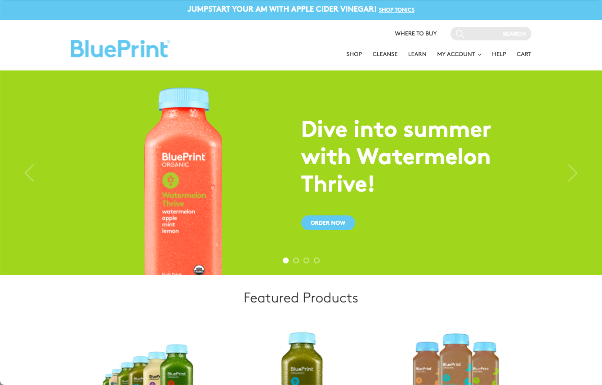

import Carousel from 'react-bootstrap/Carousel';

# Blueprint Juices

(The website is no longer operating)

**The project:** When the company I worked for acquired Blueprint, a brand that makes juice cleanses, it was already successful, but it had limited distribution on the East coast. The leadership team decided to expand distribution nationally, and they wanted a better e-commerce website for the brand to allow for that growth.

<Carousel variant="dark">
  <Carousel.Item>
    
  </Carousel.Item>
</Carousel>

Until then, our experience with e-commerce was limited to an online store run by one of our distributors. They created boutique store fronts for our brands that we integrated into our websites. The Blueprint store was the first time we took on all the responsibilities that go with building and managing an e-commerce website. My role was to provide a secure infrastructure on AWS, and work with the website developers, internal IT folks, the fulfillment house, the payment gateway, and the PCI compliance folks to get it all connected, certified as secure, and up and running as soon as possible.

It was a logistical and technical challenge, but we managed to get the website running smoothly. Orders were coming in and being processed on time, and the brand grew. I'm not sure what happened after I left the company, but the website is no longer operating.

**Built with:** LAMP, Magento, Amazon Web Services (AWS).

**Responsible for** partnering with multiple contributors, AWS for site infrastructure, overall logistics and planning.
