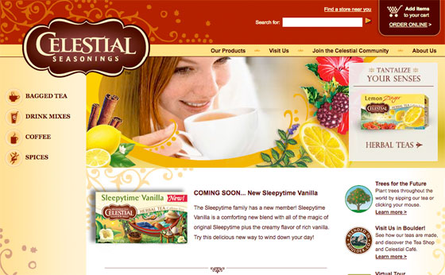
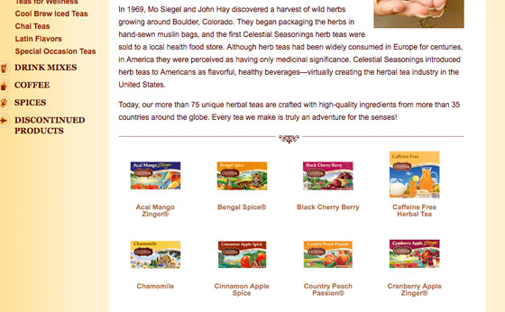
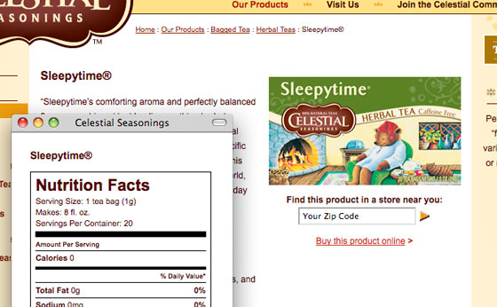
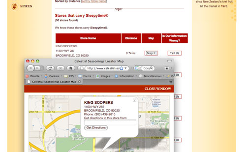
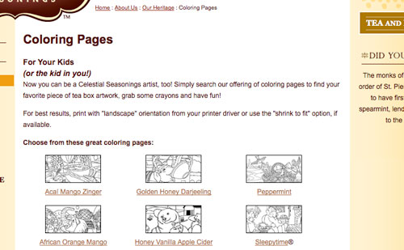

# Celestial Seasonings

[http://www.celestialseasonings.com](http://www.celestialseasonings.com/) (the site has since been redesigned)

**The project:** When the budget was exhausted for this site during the design process, I was asked to build it from the Photoshop design files.

<Carousel variant="dark">
  <Carousel.Item>
    
  </Carousel.Item>
  <Carousel.Item>
    
  </Carousel.Item>
  <Carousel.Item>
    
  </Carousel.Item>
  <Carousel.Item>
    
  </Carousel.Item>
  <Carousel.Item>
    
  </Carousel.Item>
</Carousel>

I have been involved with the Celestial Seasonings website from its first iteration in 1997 when I acted as liaison between the Creative department and the Webmaster at the time. This design was done in 2007 by an outside agency and I was tasked with building the entire site based on a few Photoshop design files.

I used this site as an opportunity to develop the CoolBrew Framework and CMS which included creating a Products module which manages and displays all the product pages including the category lists and Nutrition Facts boxes; a Lists module used to display the random Flash movies on the home page, show a random “Did you know” item, and list the International Distributors; a Pages module which manages the meta data, and dynamically generates the sub-menus and site map; and the Store Locator module which integrates search results from a local store database and a second set of results from an XML feed, integrates Google maps and implements a way for users to give feedback about the listed stores.

**Built with:** LAMP, CoolBrew/CodeIgniter.

**Responsible for:** XHTML/CSS, PHP Programming