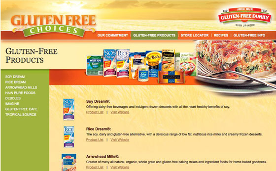
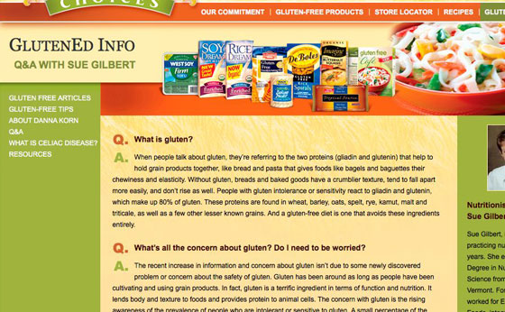
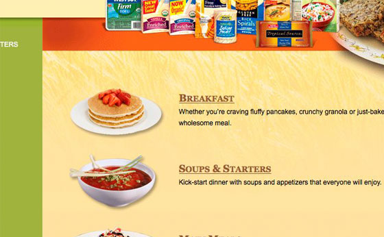

# Gluten Free Choices

(Website is no longer available)

**The project:** Build a multi-branded site from Photoshop design files.

<Carousel variant="dark">
  <Carousel.Item>
    
  </Carousel.Item>
  <Carousel.Item>
    
  </Carousel.Item>
  <Carousel.Item>
    
  </Carousel.Item>
  <Carousel.Item>
    
  </Carousel.Item>
</Carousel>

This site is basic in some ways but it proved to have a few challenges hidden within. First, it is a multi-branded site meaning that it contains product information from eight different Hain Celestial Group brands. I wanted to build the product section without having to copy any product records so that if a product changed, I didn’t have to remember to change it in two different places. That required expanding the CoolBrew products module so that I could assign a product to multiple websites.

The second challenge was with the layout. There are multiple background images that had to be stitched together along with the product lineup and beauty shot that needed to be place at the top of most of the pages. It required some fairly involved CSS and markup design to make it work.

**Built with:** LAMP, CoolBrew CMS/CodeIgniter.

**Responsible for:** XHTML/CSS, PHP Programming, CMS Integration
