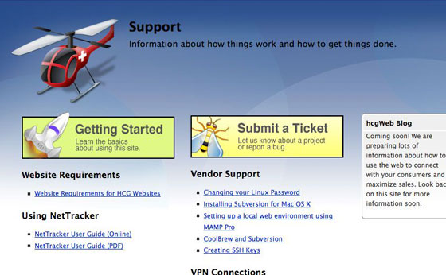
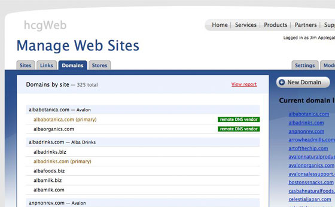

import Carousel from 'react-bootstrap/Carousel';

# hcgWeb Portal

(Website is not available)

**The project:** To build a central location where we could more effectively manage the 70+ websites we were responsible for and communicate better with our many internal and external clients.

<Carousel variant="dark">
  <Carousel.Item>
    
  </Carousel.Item>
  <Carousel.Item>
    
  </Carousel.Item>
  <Carousel.Item>
    
  </Carousel.Item>
  <Carousel.Item>
    
  </Carousel.Item>
  <Carousel.Item>
    
  </Carousel.Item>
</Carousel>

This is the main administrative website for all Hain Celestial Group websites. It serves as a portal to the many websites that we are responsible for, both hosted on our company web servers and those hosted elsewhere. It was designed to integrate with the CoolBrew CMS administrative tools as well as make it easy to link to any other web-based tool through a “links” tab. It also serves as an internal marketing site to help educate our clients about what services are available in-house and what the processes are for making changes to their websites.

**Built with:** LAMP, CoolBrew CMS/CodeIgniter

**Responsible for:** Design, XHTML/CSS, PHP Programming