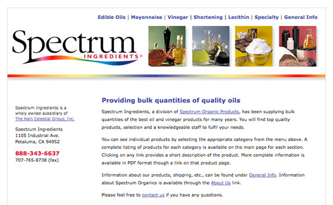

# Spectrum Ingredients

(Website is no longer available)

**The project:** Update the existing website with new information and logo.

<Carousel variant="dark">
  <Carousel.Item>
    
  </Carousel.Item>
  <Carousel.Item>
    
  </Carousel.Item>
  <Carousel.Item>
    
  </Carousel.Item>
</Carousel>

This is a simple site that didn’t use the CoolBrew CMS much except to include header and footer files and run the Contact Us form. It was a triumph in the sense that I was able to take a fairly disorganized and inconsistent site and build a clean, consistent one. It required focused attention to detail and an open dialog with the client to ensure that I didn’t make too many assumptions about how their business works. The work was completed in a couple of days.

**Built with:** HTML, CSS, CodeIgniter

**Responsible for:** Design, Content/Editing, XHTML/CSS, CMS Integration
